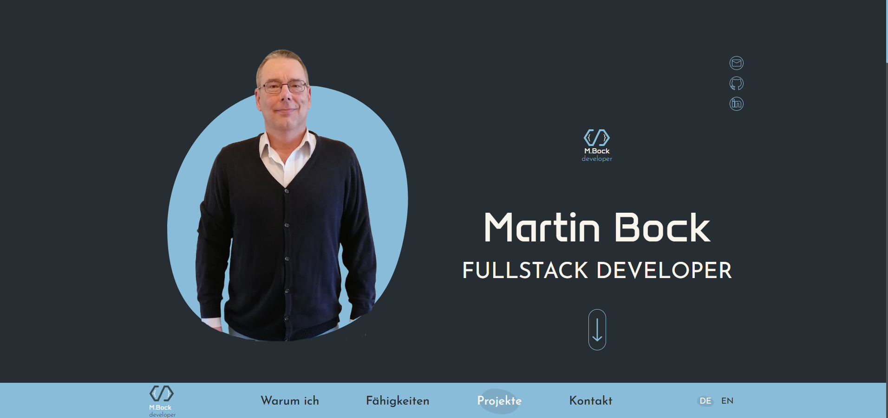

# Portfolio

**Angular Version:** This project was upgraded to version 20.2.4

Welcome to my portfolio project! This Angular application showcases my skills as a fullstack developer with a modern, responsive UI and multilingual support.

## 🚀 Features
- **Responsive Design**: Optimized for desktop and mobile
- **Multilingual**: German & English via ngx-translate
- **Component-based Architecture**: Clean structure with Angular standalone components
- **Contact Form**: Send messages directly
- **Project Overview**: Personal projects with screenshots and links
- **Legal Pages**: Imprint & Privacy Policy
- **Social Media Integration**: GitHub, LinkedIn, Email
- **Unit Tests**: High coverage for quality and reliability

## �️ Getting Started

### Start Dev Server
```bash
ng serve
```
Open [http://localhost:4200](http://localhost:4200) in your browser.

### Generate Components
```bash
ng generate component <name>
```
Other options: `directive`, `pipe`, `service`, `class`, `guard`, `interface`, `enum`, `module`.

### Build
```bash
ng build
```
The build output is stored in the `dist/` directory.

## 🧪 Unit Testing

Run all unit tests:
```bash
ng test
```
- Uses [Karma](https://karma-runner.github.io) & Jasmine
- Example test:
	```typescript
	it('should create the main content', () => {
		const fixture = TestBed.createComponent(MainContentComponent);
		const mainContent = fixture.componentInstance;
		expect(mainContent).toBeTruthy();
	});
	```

## 📦 Dependencies
- Angular 20+
- ngx-translate
- SCSS for styles

## 📄 Further Help
- [Angular CLI Documentation](https://angular.io/cli)
- `ng help` for all commands

---

**Enjoy exploring and developing!**



---

> _Created by Martin Bock_
